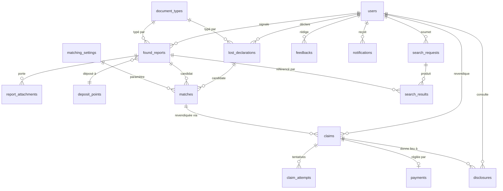

# Modèle de données

**Version :** 1.0 · **Date :** 2026-09-05

> **Règle de minimisation.** Tout champ collecté porte ici une justification
> écrite. Un champ sans justification est un champ à supprimer. Le tableau de
> justification n'est pas de la documentation d'accompagnement : c'est le
> critère d'acceptation du modèle.

Identifiants et noms de colonnes en anglais (règle §11.8 du master prompt).

---

## 1. Vue d'ensemble



`audit_logs` n'a de relation avec rien : c'est un journal append-only,
volontairement détaché du graphe relationnel.

---

## 2. Entités

### 2.1 `users`

Un seul type de compte ; les rôles Propriétaire et Trouveur sont des capacités,
pas des colonnes (D-004).

| Colonne | Type | Justification |
|---|---|---|
| `id` | uuid | Identifiant non séquentiel : un entier auto-incrémenté révèle le volume d'utilisateurs et permet l'énumération. |
| `full_name` | text | Contrôle de cohérence entre le nom du compte et le nom revendiqué (`THREAT_MODEL.md` M-01, M-02). |
| `full_name_normalized` | text | Rend ce contrôle robuste aux accents et à l'ordre des tokens. Voir `MATCHING.md` §2. |
| `email` | citext, unique | Canal de notification secondaire et récupération de compte. |
| `email_verified_at` | timestamptz | Preuve de contrôle de l'adresse. |
| `phone_e164` | text, unique | **Contrôle anti-Sybil principal** (D-013). Unicité stricte : un numéro, un compte actif. |
| `phone_verified_at` | timestamptz | Sans cette date, le compte ne peut ni rechercher, ni revendiquer. |
| `password_hash` | text | Authentification. |
| `two_factor_secret` | text, chiffré, nullable | Obligatoire pour les administrateurs (D-014). |
| `admin_role` | enum(`none`,`functional`,`sensitive`,`both`) | Séparation administration fonctionnelle / revue sensible (D-014). `none` pour un utilisateur ordinaire. |
| `reporter_score` | smallint | Fiabilité du Trouveur, pour retenir les signalements suspects en revue (M-06). |
| `locale` | text | Interface bilingue français/anglais. |
| `notification_prefs` | jsonb | Préférences par canal et désabonnement (§7 du master prompt). |
| `blocked_until` | timestamptz, nullable | Blocage progressif après détection d'abus (M-07). |
| `created_at`, `updated_at` | timestamptz | Détection de création de comptes en rafale (M-04). |

**Champs volontairement absents :** date de naissance, adresse postale, pièce
d'identité du titulaire du compte, photographie de profil. Aucun n'est
nécessaire au rapprochement, et chacun augmenterait la valeur d'une fuite.

---

### 2.2 `document_types`

| Colonne | Type | Justification |
|---|---|---|
| `id` | smallint | Catégorie gérée par l'Administrateur (§1.10). |
| `code` | text, unique | Identifiant stable en anglais, indépendant du libellé affiché. |
| `label_fr`, `label_en` | text | Interface bilingue. |
| `sensitivity` | enum(`standard`,`high`) | `high` pour passeport et CNI : impose la revue humaine obligatoire avant restitution (M-01). |
| `number_min_length`, `number_max_length` | smallint, nullable | Validation permissive (D-012) : longueur seulement, pas d'expression régulière — les formats réels ne sont pas connus. |
| `number_alphabet` | text, nullable | Idem. Modifiable sans redéploiement. |
| `retention_days` | smallint | Rétention par type, dérivée de D-010. |
| `is_active` | boolean | Retrait d'une catégorie sans perte d'historique. |

Jeu initial : les 8 catégories relevées dans le prototype
(`AUDIT_PROTOTYPE.md` §4.2).

---

### 2.3 `deposit_points`

Entité administrable. **Aucun point réel n'existe à ce jour** (D-009, C-03).

| Colonne | Type | Justification |
|---|---|---|
| `id` | uuid | — |
| `name` | text | Contenu de l'information N3. |
| `kind` | enum(`police`,`city_hall`,`partner`,`other`) | Le circuit de retrait diffère selon le type d'organisme. |
| `region`, `city` | text | Alimente le masquage géographique progressif (`DISCLOSURE_LEVELS.md`). |
| `address`, `opening_hours` | text | Information N3 utile au Propriétaire. |
| `institutional_contact` | text, nullable | Contact de l'**organisme**, jamais d'une personne physique. |
| `is_verified` | boolean | Un point non vérifié n'entre pas en N3. |

---

### 2.4 `lost_declarations`

| Colonne | Type | Justification |
|---|---|---|
| `id` | uuid | Non énumérable. |
| `user_id` | uuid FK | Auteur ; support du contrôle de cohérence de nom (M-02). |
| `document_type_id` | smallint FK | Critère de rapprochement dur : jamais de correspondance inter-types. |
| `owner_name` | text | Critère de rapprochement principal. |
| `owner_name_normalized` | text | Comparaison trigramme (`MATCHING.md`). |
| `number_encrypted` | bytea, chiffré | Nécessaire en N3. **Jamais indexé** (D-007). |
| `number_hmac` | bytea, indexé, nullable | Égalité exacte sans exposer le numéro (D-007). |
| `number_last4` | text, chiffré, nullable | Confirmation N2, uniquement en réponse à une saisie de l'utilisateur. |
| `lost_on` | date, nullable | Cohérence temporelle du rapprochement : une découverte antérieure à la perte est impossible. |
| `lost_region`, `lost_city` | text, nullable | Faible poids dans le score ; alimente le masquage progressif. |
| `extra_info` | text, nullable | **Jamais exposé avant N3** (M-11). Non indexé. |
| `name_matches_account` | boolean | Résultat du contrôle de cohérence (M-02). `false` ⇒ aucune notification automatique, passage en revue. |
| `status` | enum(`active`,`matched`,`resolved`,`expired`,`withdrawn`) | Cycle de vie. |
| `expires_at` | timestamptz | Rétention 180 jours (D-010). Purge **effective** par cron. |

---

### 2.5 `found_reports`

| Colonne | Type | Justification |
|---|---|---|
| `id` | uuid | Non énumérable. |
| `finder_user_id` | uuid FK | Traçabilité, score de fiabilité, plafonds par compte (M-06). |
| `document_type_id` | smallint FK | Critère dur. |
| `owner_name`, `owner_name_normalized` | text, nullable | Le Trouveur ne connaît pas toujours le nom. |
| `number_encrypted`, `number_hmac`, `number_last4` | — | Comme en 2.4 (D-007). |
| `found_on` | date | Cohérence temporelle. Exposée en N1 tronquée au mois. |
| `found_region`, `found_city` | text | Divulgation progressive : région en N1, ville en N2. |
| `deposit_point_id` | uuid FK, nullable | Contenu de N3 (D-009). |
| `deposit_reference` | text, chiffré, nullable | Référence remise au Trouveur lors du dépôt. N3 uniquement. |
| `deposit_free_text` | text, nullable | Saisie libre tant qu'aucun partenaire n'existe (C-03). **Revue administrateur obligatoire avant N3** (M-11). |
| `extra_info` | text, nullable | **Jamais avant N3** (M-11). Non indexé. |
| `duplicate_fingerprint` | bytea, indexé | Détection de doublons sur empreinte normalisée, pas sur égalité stricte (§4.5). Voir §4 ci-dessous. |
| `status` | enum(`pending_review`,`active`,`matched`,`returned`,`rejected`,`expired`) | `pending_review` pour un Trouveur à faible score (M-06). |
| `expires_at` | timestamptz | Rétention 180 jours (D-010). |

**Absent volontairement :** aucun compteur de correspondances, aucun statut de
rapprochement visible du Trouveur. Le Trouveur ne reçoit **aucun** retour sur
le sort de ses signalements (M-06).

---

### 2.6 `report_attachments`

Références d'images. **Jamais de binaire en base.**

| Colonne | Type | Justification |
|---|---|---|
| `id` | uuid | — |
| `found_report_id` | uuid FK | — |
| `object_key` | text | Clé dans le stockage objet privé. Non devinable (M-12). |
| `content_hash` | bytea | Détection de doublons et intégrité. |
| `mime_type`, `byte_size`, `width`, `height` | — | Validation serveur stricte (§3.3). |
| `exif_stripped_at` | timestamptz | **Preuve que la suppression EXIF serveur a eu lieu.** Une pièce d'identité photographiée embarque des coordonnées GPS. Un enregistrement sans cette date ne doit jamais être servi. |
| `expires_at` | timestamptz | Rétention **90 jours** — la plus courte du modèle (D-010). |

---

### 2.7 `matches`

| Colonne | Type | Justification |
|---|---|---|
| `id` | uuid | — |
| `lost_declaration_id`, `found_report_id` | uuid FK | Le couple rapproché. |
| `algorithm_version` | text | Traçabilité : sans elle, ni réglage de seuil ni explication d'un faux positif (§5). |
| `score` | numeric(4,3) | Score global. **Jamais exposé à un utilisateur** — c'est un oracle de matching. |
| `score_breakdown` | jsonb | Contribution par champ. Indispensable au réglage des seuils. |
| `status` | enum(`candidate`,`notified`,`under_review`,`confirmed`,`rejected`,`expired`) | Cycle de vie. |
| `notified_at` | timestamptz, nullable | Idempotence de la notification. |
| `created_at` | timestamptz | — |

**Contrainte :** `UNIQUE (lost_declaration_id, found_report_id,
algorithm_version)`. C'est ce qui garantit qu'un même couple ne produit qu'une
correspondance et qu'une notification, quel que soit le nombre de passages du
cron (§5).

---

### 2.8 `claims` et `claim_attempts`

`claims` — une revendication d'un utilisateur sur une correspondance.

| Colonne | Type | Justification |
|---|---|---|
| `id` | uuid | — |
| `match_id`, `claimant_user_id` | uuid FK | — |
| `status` | enum(`open`,`proof_failed`,`proof_passed`,`admin_review`,`approved`,`rejected`,`fulfilled`,`refunded`) | Cycle complet, remboursement inclus (D-016). |
| `name_consistency` | enum(`match`,`mismatch`,`unknown`) | Incohérence ⇒ revue administrateur, jamais refus silencieux (M-01). |
| `attempts_used` | smallint | **3 tentatives à vie**, pas 3 par heure (M-03). |
| `admin_decision_by`, `admin_decision_at`, `admin_decision_reason` | — | Revue humaine obligatoire sur les types `sensitivity = high`. |
| `disclosed_level` | smallint | Niveau effectivement atteint. |

**Contrainte :** `UNIQUE (match_id, claimant_user_id)` et interdiction, par
contrainte et par Policy, que `claimant_user_id` soit le `finder_user_id` du
signalement — un compte ne peut pas s'auto-attribuer un document (D-004).

`claim_attempts` — une ligne par tentative de preuve.

| Colonne | Type | Justification |
|---|---|---|
| `claim_id` | uuid FK | — |
| `submitted_fields_hash` | bytea | Les éléments fournis sont **hachés, jamais stockés en clair** : ce sont des données de niveau B-5, et les conserver en clair créerait la fuite qu'on cherche à éviter. Le hachage suffit à détecter un balayage. |
| `result` | boolean | Résultat global, jamais par champ (M-03). |
| `ip`, `session_fingerprint`, `created_at` | — | Détection d'abus, alerte administrateur au-delà d'un seuil. |

---

### 2.9 `search_requests` et `search_results`

Exigées par la recherche asynchrone différée (D-008).

`search_requests` : `id`, `user_id`, `document_type_id`, `owner_name_normalized`,
`number_hmac`, critères complémentaires, `criteria_combination` (C1 ou C2, §3
de `DISCLOSURE_LEVELS.md`), `status`, `result_count_bucket`, `ip`, `created_at`,
`processed_at`.

**Justification :** journaliser chaque recherche (auteur, critères, nombre de
résultats) est une exigence explicite de la §4.2. Le stockage sous forme de
demande, et non d'appel synchrone, est ce qui supprime le canal temporel (M-05).
`result_count_bucket` conserve un ordre de grandeur pour la détection d'abus
**sans** que le nombre exact ne soit jamais exposé (M-07).

`search_results` : `search_request_id`, `found_report_id`, `score`. Purgé
agressivement — durée de vie de quelques jours, indépendante de D-010.

---

### 2.10 `payments`

| Colonne | Type | Justification |
|---|---|---|
| `id` | uuid | — |
| `claim_id` | uuid FK | Le paiement suit toujours une vérification réussie (D-016). |
| `provider` | text | `fake` tant qu'aucun prestataire n'est confirmé. |
| `provider_reference` | text, unique | **Idempotence stricte** : aucun double débit possible. |
| `idempotency_key` | text, unique | Rejeu de webhook sans effet de bord. |
| `amount_minor`, `currency` | — | Montant en unité mineure, pour éviter tout flottant. |
| `status` | enum(`pending`,`succeeded`,`failed`,`expired`,`partial`,`refunded`) | `partial` et `expired` sont fréquents en mobile money et doivent être des états de première classe, pas des cas d'erreur. |
| `confirmed_server_side_at` | timestamptz, nullable | **Seul champ qui autorise le passage en N3.** Renseigné uniquement par confirmation serveur-à-serveur, jamais par une redirection navigateur. |
| `webhook_payloads` | jsonb | Journalisation intégrale, signatures comprises. |
| `reconciled_at` | timestamptz, nullable | Cron de réconciliation des transactions restées en suspens. |

**Aucune donnée de paiement sensible n'est stockée** : ni numéro de téléphone
payeur au-delà de ce que le prestataire renvoie, ni identifiant bancaire.

---

### 2.11 `disclosures`, `notifications`, `feedbacks`, `audit_logs`

`disclosures` : `actor_user_id`, `subject_type`, `subject_id`, `level`,
`context` (recherche, revendication, revue admin), `reason` (obligatoire pour un
accès administrateur sensible), `signed_url_generated` (booléen), `ip`,
`session_fingerprint`, `created_at`. C'est la trace de « qui a vu quoi, à quel
niveau, quand », exigée par la §4.4.

`notifications` : `user_id`, `channel` (`email`/`sms`), `template`,
`idempotency_key` **unique** (jamais deux fois la même notification),
`status`, `sent_at`, `failed_at`, `retry_count`. **Aucune colonne ne contient
de contenu de niveau N2 ou N3** : le corps du message est reconstruit à
l'envoi à partir du gabarit et ne contient que l'annonce d'une correspondance
et une invitation à se connecter (M-10).

`feedbacks` : `user_id`, `subject`, `rating`, `message`, `status`,
`admin_notes`, `handled_by`, `handled_at`.

`audit_logs` : `actor_user_id`, `actor_role`, `action`, `entity_type`,
`entity_id`, `reason`, `ip`, `session_fingerprint`, `created_at`.
**Append-only** : aucune mise à jour ni suppression, y compris par un
administrateur. Appliqué par **révocation des droits `UPDATE` et `DELETE` sur
cette table pour le rôle applicatif**, pas seulement par convention de code.
Rétention 3 ans (D-010).

`matching_settings` : `algorithm_version`, `notify_threshold`,
`review_threshold`, pondérations par champ, `is_active`. Les seuils sont
**configurables sans redéploiement** (§5).

---

## 3. L'arbitrage chiffrement / recherche approximative

C'est le conflit de conception central du modèle, tranché en D-007.

**Le conflit.** Un cast chiffré Laravel produit un ciphertext qui n'est ni
ordonnable, ni comparable par similarité, ni indexable utilement. Chiffrer les
numéros **et** faire du rapprochement approximatif sur les numéros est
impossible : il faut choisir.

**Solution retenue.**

| Forme | Indexée | Usage |
|---|---|---|
| `number_encrypted` | Non | Restitution en N3 après déchiffrement serveur |
| `number_hmac` | Oui | Égalité exacte après normalisation |
| `number_last4` (chiffré) | Non | Confirmation N2 d'une saisie utilisateur |

**Ce qu'on perd :** la distance d'édition sur les numéros. Un numéro saisi avec
un chiffre de trop ou de moins ne se rapprochera pas par ce champ.

**Ce qu'on gagne :** une copie brute de la base — sauvegarde Supabase fuitée,
réquisition, compromission de l'hébergeur — **ne livre aucun numéro de pièce
d'identité**. C'est le seul contrôle du projet efficace contre M-08, qui
contourne par nature tous les contrôles applicatifs.

**Compensation :** le rapprochement approximatif porte sur le **nom**, qui
reste en clair normalisé, et la file de revue administrateur rattrape une
partie des cas manqués. L'impact réel sur le rappel est mesuré et publié dans
`MATCHING.md`.

**Conséquence sur les clés :** la clé de chiffrement et la clé HMAC vivent en
variables d'environnement, **hors de la base**. Une rotation de la clé HMAC
impose de recalculer tous les `number_hmac` : la procédure est à écrire au
jalon 1, avant qu'il y ait des données.

---

## 4. Empreinte de doublon

La §1.5 exige un contrôle de doublon avant enregistrement. La §4.5 précise
qu'il doit porter sur une **empreinte normalisée**, pas sur une égalité stricte.

```
duplicate_fingerprint = sha256(
      document_type_id
   || number_normalized                 (vide si absent)
   || owner_name_normalized_sorted      (tokens triés)
)
```

Une collision d'empreinte ne rejette pas automatiquement le signalement : elle
le place en `pending_review`. Un même document peut légitimement être signalé
deux fois par deux personnes différentes, et refuser un signalement légitime
coûte plus cher au projet qu'un doublon à trier.

---

## 5. Index

| Table | Index | Raison |
|---|---|---|
| `lost_declarations` | GIN `gin_trgm_ops` sur `owner_name_normalized` | Présélection trigramme (`MATCHING.md`) |
| `lost_declarations` | B-tree `(document_type_id, status)` | Filtre dur du moteur |
| `lost_declarations` | B-tree sur `number_hmac` | Égalité exacte |
| `found_reports` | Les trois mêmes | Symétrie du rapprochement bidirectionnel |
| `found_reports` | B-tree sur `duplicate_fingerprint` | Contrôle de doublon |
| `matches` | UNIQUE `(lost_declaration_id, found_report_id, algorithm_version)` | Idempotence |
| `*` | B-tree sur `expires_at` | Efficacité du cron de purge |
| `audit_logs`, `disclosures` | B-tree `(actor_user_id, created_at)` | Consultation du journal |

**À vérifier au jalon 1 :** que la présélection soit bien un *index scan* et
non un *seq scan*, par `EXPLAIN (ANALYZE, BUFFERS)` sur 100 000 lignes
synthétiques. Si c'est un *seq scan*, la conception du moteur est à revoir avant
d'aller plus loin.

---

## 6. Contraintes `CHECK` retenues

- `found_on >= lost_on` n'est **pas** une contrainte de base (les deux tables
  sont distinctes) mais une règle du moteur : une découverte antérieure à la
  perte annule le score (`MATCHING.md` §3).
- `attempts_used <= 3` sur `claims`.
- `amount_minor > 0` sur `payments`.
- `claimant_user_id <> finder_user_id` — vérifié par déclencheur et par Policy
  (D-004).
- `expires_at > created_at` partout où le champ existe.
- Sur `report_attachments` : un enregistrement dont `exif_stripped_at` est nul
  ne peut pas être servi — vérifié applicativement, la contrainte de base ne
  pouvant pas exprimer « ne pas servir ».

---

## 7. Ce que le modèle ne contient pas, délibérément

| Donnée écartée | Raison |
|---|---|
| Date et lieu de naissance du titulaire du compte | Non nécessaires au rapprochement ; augmenteraient fortement la valeur d'une fuite |
| Pièce d'identité du titulaire du compte | Rendrait la plateforme dépositaire de documents des deux côtés |
| Géolocalisation précise du Trouveur | La région suffit au rapprochement |
| Contenu en clair des éléments de preuve | Stockés hachés (§2.8) |
| Historique de navigation | Aucun usage identifié |
| Contenu des notifications | Reconstruit à l'envoi (M-10) |
| Coordonnées personnelles d'un dépositaire | Seul le contact institutionnel est conservé |
